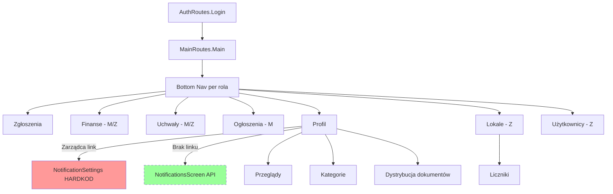

# Gap Analysis — BlokUR

**Data rozpoczęcia:** 2026-06-05  
**Źródła:** `audit/01_backend_inventory.md`, `audit/02_frontend_inventory.md`, weryfikacja kodu `frontend/`

**Legenda statusów:**
- ✅ **POKRYTY** — frontend wywołuje endpoint i obsługuje sukces + błąd
- ⚠️ **CZĘŚCIOWO** — wywołanie istnieje, brakuje elementów (błędy, loading, role, hardkod)
- ❌ **BRAK** — endpoint backendowy nie jest wywoływany z frontendu

**Kolejność analizy:** moduły backendu 4→3→5→1→2→8→9→6→7→10→11→12 (zaakceptowano 2026-06-05).

---

## Moduł 4: Zgłoszenia serwisowe (20 endpointów)

| Metoda | Endpoint | Status | Uwagi | Rola (❌) | Priorytet |
|--------|----------|--------|-------|-----------|-----------|
| POST | `/api/tickets` | ✅ | `CreateTicketViewModel` — Loading/Error/Success; walidacja 403/400 w `TicketService` | — | — |
| GET | `/api/tickets` | ⚠️ | Wywoływany; filtry tylko `status` + `search` (brak category/building/assignedTo/dat); paginacja wysyłana, backend jej nie obsługuje — UX „load more” może być mylący; błąd przy `loadNextPage` bez snackbara | ZARZĄDCA | ŚREDNI |
| GET | `/api/tickets/{id}` | ✅ | `TicketDetailsViewModel` — Error state | — | — |
| PATCH | `/api/tickets/{id}/assign` | ✅ | Tylko UI ZARZĄDCA; snackbar + reload | — | — |
| PATCH | `/api/tickets/{id}/close` | ✅ | ZARZĄDCA z FAB; błędy przez `TicketService.handleResponse` | — | — |
| PATCH | `/api/tickets/{id}/reject` | ✅ | `ManagerRejectSheet` + obsługa błędów | — | — |
| PATCH | `/api/tickets/{id}/start` | ✅ | KONSERWATOR — `ConservatorActionSheet` | — | — |
| PATCH | `/api/tickets/{id}/suspend` | ✅ | j.w. | — | — |
| POST | `/api/tickets/{id}/completion` | ✅ | j.w. (`FINISH`) | — | — |
| PATCH | `/api/tickets/{id}/status` | ❌ | Zdefiniowany w `TicketApiService.changeStatus`, **nigdzie nie wywołany**; wznowienie ze `WSTRZYMANO` otwiera sheet przypisania zamiast zmiany statusu | ZARZĄDCA | WYSOKI |
| POST | `/api/tickets/{id}/comments` | ⚠️ | Wywołanie jest, ale **brak sprawdzenia `response.isSuccessful`** — ciche niepowodzenie; brak loading przy wysyłce | M/Z/K | ŚREDNI |
| GET | `/api/tickets/{id}/comments` | ⚠️ | Przy HTTP≠200 → pusta lista **bez** komunikatu (tylko `onFailure` przy wyjątku sieci); `isLoadingComments` OK | M/Z/K | ŚREDNI |
| POST | `/api/tickets/{id}/images` | ❌ | `TicketMediaServices.uploadImage` istnieje, **brak powiązania z ViewModel/UI** — konserwator nie może dodać zdjęć | KONSERWATOR / MIESZKANIEC | **KRYTYCZNY** |
| GET | `/api/tickets/{id}/images` | ⚠️ | Lista metadanych ładowana; UI pokazuje emoji 📷 zamiast miniaturek; przycisk „usuń” woła **nieistniejący** backendowo `DELETE /api/images/{id}` | M/Z/K | WYSOKI |
| GET | `/api/images/{id}` | ❌ | `serveImage` w Retrofit, **nigdy nie używany** w UI | KONSERWATOR | **KRYTYCZNY** |
| GET | `/api/categories` | ✅ | `CreateTicketViewModel` + `CategoriesViewModel`; publiczny endpoint | — | — |
| POST | `/api/admin/categories` | ✅ | `CategoriesViewModel` — błędy → snackbar | ZARZĄDCA | — |
| PUT | `/api/admin/categories/{id}` | ✅ | j.w. | ZARZĄDCA | — |
| PATCH | `/api/admin/categories/{id}/sla` | ✅ | j.w. | ZARZĄDCA | — |
| PATCH | `/api/admin/categories/{id}/deactivate` | ✅ | j.w. | ZARZĄDCA | — |

**Uwagi modułowe:**
- FAB „Utwórz zgłoszenie” widoczny dla ZARZĄCY i MIESZKAŃCA (`TicketsScreen`), backend `POST /api/tickets` = tylko **MIESZKANIEC** → zarządca dostanie 403.
- PDF protokół (`POST /api/pdf/work-acceptance-protocol`) — ✅ w `TicketDetailsViewModel` (moduł 12).
- `GET /api/users?role=KONSERWATOR` — ✅ przy przypisaniu.

**Podsumowanie modułu 4:** ✅ 13 | ⚠️ 4 | ❌ 3

---

## Moduł 3: Nieruchomości (15 endpointów)

| Metoda | Endpoint | Status | Uwagi | Rola (❌) | Priorytet |
|--------|----------|--------|-------|-----------|-----------|
| POST | `/api/properties` | ✅ | `PropertyTreeViewModel` — CRUD z Loading/Error | ZARZĄDCA | — |
| PUT | `/api/properties/{id}` | ✅ | j.w. | ZARZĄDCA | — |
| GET | `/api/properties` | ✅ | Lista w drzewie + `CommunityLogoViewModel` | ZARZĄDCA | — |
| GET | `/api/properties/{id}` | ❌ | `getPropertyById` w Retrofit, **brak wywołania** — UI używa listy / pierwszego elementu | ZARZĄDCA | NISKI |
| PATCH | `/api/properties/{id}/logo` | ✅ | `CommunityLogoViewModel` — multipart, snackbar | ZARZĄDCA | — |
| GET | `/api/buildings/tree` | ✅ | Drzewo lokali, finanse (mieszkaniec), edycja użytkowników | ZARZĄDCA / M* | — |
| POST | `/api/buildings` | ✅ | PropertyTree CRUD | ZARZĄDCA | — |
| PUT | `/api/buildings/{id}` | ✅ | j.w. | ZARZĄDCA | — |
| DELETE | `/api/buildings/{id}` | ✅ | j.w. | ZARZĄDCA | — |
| POST | `/api/buildings/{id}/staircases` | ✅ | j.w. | ZARZĄDCA | — |
| PUT | `/api/buildings/{id}/staircases/{stId}` | ✅ | j.w. | ZARZĄDCA | — |
| DELETE | `/api/buildings/{id}/staircases/{stId}` | ✅ | j.w. | ZARZĄDCA | — |
| POST | `/api/staircases/{id}/apartments` | ✅ | j.w. | ZARZĄDCA | — |
| PUT | `/api/staircases/{id}/apartments/{aptId}` | ✅ | j.w. | ZARZĄDCA | — |
| DELETE | `/api/staircases/{id}/apartments/{aptId}` | ✅ | j.w. | ZARZĄDCA | — |

\* `GET /api/buildings/tree` wywoływany także dla mieszkańca w `FinancialLedgerViewModel` (pobranie „pierwszego” lokalu z drzewa — omówione w module 6).

**Podsumowanie modułu 3:** ✅ 14 | ⚠️ 0 | ❌ 1

---

## Moduł 5: Liczniki i odczyty (8 endpointów)

| Metoda | Endpoint | Status | Uwagi | Rola (❌) | Priorytet |
|--------|----------|--------|-------|-----------|-----------|
| POST | `/api/apartments/{id}/meters` | ✅ | `MeterListViewModel` — tylko nawigacja z drzewa lokali (ZARZĄDCA) | ZARZĄDCA | — |
| GET | `/api/apartments/{id}/meters` | ✅ | j.w. | Z/K/M* | — |
| PATCH | `/api/meters/{id}/deactivate` | ❌ | Brak akcji w UI (`MeterListScreen`) | ZARZĄDCA | ŚREDNI |
| POST | `/api/apartments/{id}/meter-readings` | ✅ | `MeterDetailViewModel` | ZARZĄDCA / K | — |
| GET | `/api/apartments/{id}/meter-readings` | ✅ | Lista + paginacja w VM | Z/K/M* | — |
| GET | `/api/meter-readings/{id}` | ❌ | `MeterService.getMeterReadingById` — **nieużywany**; szczegóły z listy | Z/K/M | NISKI |
| PUT | `/api/meter-readings/{id}` | ✅ | Dialog edycji w `MeterDetailViewModel` | ZARZĄDCA | — |
| DELETE | `/api/meter-readings/{id}` | ✅ | j.w. | ZARZĄDCA | — |

\* Backend dopuszcza MIESZKAŃCA/KONSERWATORA do odczytu; **brak ścieżki nawigacji** w aplikacji dla tych ról → funkcja de facto tylko dla zarządcy.

**Podsumowanie modułu 5:** ✅ 6 | ⚠️ 0 | ❌ 2

---

## Moduł 1: Autentykacja (5 endpointów)

| Metoda | Endpoint | Status | Uwagi | Rola (❌) | Priorytet |
|--------|----------|--------|-------|-----------|-----------|
| POST | `/api/auth/login` | ⚠️ | ✅ 401/423; **brak obsługi HTTP 429** (rate limit backendu) | wszyscy | ŚREDNI |
| POST | `/api/auth/refresh` | ✅ | `TokenAuthenticator` — automatyczny retry | wszyscy | — |
| POST | `/api/auth/forgot-password` | ⚠️ | Działa; brak 429 | wszyscy | NISKI |
| POST | `/api/auth/reset-password` | ⚠️ | Działa; brak 429; brak obsługi 410 (wygasły token) | wszyscy | ŚREDNI |
| POST | `/api/auth/accept-invitation` | ✅ | `AcceptInvitationViewModel` | zaproszony | — |

**Podsumowanie modułu 1:** ✅ 2 | ⚠️ 3 | ❌ 0

---

## Moduł 2: Użytkownicy (5 endpointów)

| Metoda | Endpoint | Status | Uwagi | Rola (❌) | Priorytet |
|--------|----------|--------|-------|-----------|-----------|
| GET | `/api/users?role=…` | ✅ | Lista konserwatorów przy przypisaniu zgłoszenia | ZARZĄDCA | — |
| GET | `/api/admin/users` | ✅ | `UsersViewModel` | ZARZĄDCA | — |
| POST | `/api/admin/users` | ✅ | `CreateUserDialog` + drzewo lokali | ZARZĄDCA | — |
| PATCH | `/api/admin/users/{id}` | ✅ | `EditUserViewModel` | ZARZĄDCA | — |
| PATCH | `/api/admin/users/{id}/deactivate` | ✅ | j.w. | ZARZĄDCA | — |

**Podsumowanie modułu 2:** ✅ 5 | ⚠️ 0 | ❌ 0

---

## Moduł 8: Ogłoszenia (5 endpointów)

| Metoda | Endpoint | Status | Uwagi | Rola (❌) | Priorytet |
|--------|----------|--------|-------|-----------|-----------|
| GET | `/api/announcements` | ✅ | `AnnouncementsViewModel` — Empty/Error/Loading | M/Z | — |
| POST | `/api/announcements` | ✅ | `CreateAnnouncementViewModel` — multipart | ZARZĄDCA | — |
| PUT | `/api/announcements/{id}` | ❌ | W Retrofit (`AnnouncementApiService`), **brak ekranu edycji** — tylko create/delete | ZARZĄDCA | WYSOKI |
| DELETE | `/api/announcements/{id}` | ✅ | ZARZĄDCA na liście | ZARZĄDCA | — |
| GET | `/api/announcements/{id}/attachment` | ✅ | Pobieranie PDF do cache + Intent | M/Z | — |

**Podsumowanie modułu 8:** ✅ 4 | ⚠️ 0 | ❌ 1

---

## Moduł 9: Uchwały (5 endpointów)

| Metoda | Endpoint | Status | Uwagi | Rola (❌) | Priorytet |
|--------|----------|--------|-------|-----------|-----------|
| POST | `/api/resolutions` | ✅ | Dialog tworzenia w `ResolutionsListViewModel` | ZARZĄDCA | — |
| GET | `/api/resolutions` | ✅ | Lista — Loading/Error | M/Z | — |
| GET | `/api/resolutions/{id}` | ✅ | `ResolutionDetailViewModel` | M/Z | — |
| GET | `/api/resolutions/{id}/report` | ✅ | PDF dla zarządcy | ZARZĄDCA | — |
| POST | `/api/resolutions/{id}/vote` | ✅ | Głosowanie mieszkańca | MIESZKANIEC | — |

**Podsumowanie modułu 9:** ✅ 5 | ⚠️ 0 | ❌ 0

---

## Moduł 6: Finanse (4 endpointów)

| Metoda | Endpoint | Status | Uwagi | Rola (❌) | Priorytet |
|--------|----------|--------|-------|-----------|-----------|
| GET | `/api/apartments/{id}/transactions` | ⚠️ | **Hub `FinancesViewModel`:** dla MIESZKAŃCA `apartmentId=null` → saldo 0, pusta lista **bez wywołania API**; dopiero `FinancialLedgerViewModel` woła API przez `getBuildingTree()` + **pierwszy lokal z drzewa** (niekoniecznie lokal użytkownika) | MIESZKANIEC | **KRYTYCZNY** |
| POST | `/api/apartments/{id}/transactions` | ✅ | Dialog w kartotece — tylko ZARZĄDCA | ZARZĄDCA | — |
| POST | `/api/finance/import` | ✅ | `CsvImportScreen` | ZARZĄDCA | — |
| GET | `/api/admin/apartments/balances` | ✅ | `ApartmentBalancesScreen` + opcjonalnie PDF | ZARZĄDCA | — |

**Podsumowanie modułu 6:** ✅ 3 | ⚠️ 1 | ❌ 0

---

## Moduł 7: Dokumenty (4 endpointów)

| Metoda | Endpoint | Status | Uwagi | Rola (❌) | Priorytet |
|--------|----------|--------|-------|-----------|-----------|
| GET | `/api/documents` | ✅ | `FinancesViewModel` / `UserDocumentService` — backend filtruje po roli | M/Z | — |
| GET | `/api/documents/{id}/download` | ✅ | Pobieranie PDF + FileProvider | M/Z | — |
| POST | `/api/admin/documents/rate-change` | ✅ | `DocumentDistributionScreen` | ZARZĄDCA | — |
| POST | `/api/admin/documents/annual-settlement` | ✅ | j.w. | ZARZĄDCA | — |

**Podsumowanie modułu 7:** ✅ 4 | ⚠️ 0 | ❌ 0

---

## Moduł 10: Przeglądy techniczne (4 endpointów)

| Metoda | Endpoint | Status | Uwagi | Rola (❌) | Priorytet |
|--------|----------|--------|-------|-----------|-----------|
| POST | `/api/inspections` | ✅ | `InspectionsListViewModel` | ZARZĄDCA | — |
| GET | `/api/inspections` | ⚠️ | API podłączone; dostęp **tylko z Profilu → zarządca**; MIESZKANIEC/KONSERWATOR nie mają linku (backend zwraca dane wg roli) | M/K | ŚREDNI |
| PUT | `/api/inspections/{id}` | ✅ | Dialog edycji | ZARZĄDCA | — |
| DELETE | `/api/inspections/{id}` | ✅ | j.w. | ZARZĄDCA | — |

**Podsumowanie modułu 10:** ✅ 3 | ⚠️ 1 | ❌ 0

---

## Moduł 11: Powiadomienia i urządzenia (4 endpointów)

| Metoda | Endpoint | Status | Uwagi | Rola (❌) | Priorytet |
|--------|----------|--------|-------|-----------|-----------|
| POST | `/api/devices/register` | ⚠️ | Wywołanie po loginie, ale `NoOpFcmTokenProvider` → token **null** → rejestracja zwykle pomijana | wszyscy | WYSOKI |
| DELETE | `/api/devices/{token}` | ⚠️ | Przy logout; skuteczne tylko jeśli token był zarejestrowany | wszyscy | ŚREDNI |
| GET | `/api/admin/notifications/settings` | ⚠️ | `NotificationsScreen` + VM **istnieją**, ale Profil prowadzi do `NotificationSettingsScreen` (**hardkod**); `NotificationRoutes.Settings` **bez linku w UI** | ZARZĄDCA | **KRYTYCZNY** |
| PATCH | `/api/admin/notifications/settings/{eventType}` | ⚠️ | j.w. — kod OK, nawigacja zerowa | ZARZĄDCA | **KRYTYCZNY** |

**Podsumowanie modułu 11:** ✅ 0 | ⚠️ 4 | ❌ 0

---

## Moduł 12: PDF (2 endpointów)

| Metoda | Endpoint | Status | Uwagi | Rola (❌) | Priorytet |
|--------|----------|--------|-------|-----------|-----------|
| POST | `/api/pdf/work-acceptance-protocol` | ✅ | `TicketDetailsViewModel` — loading + błąd | Z/K | — |
| GET | `/api/pdf/balances` | ✅ | `ApartmentBalancesViewModel` | ZARZĄDCA | — |

**Podsumowanie modułu 12:** ✅ 2 | ⚠️ 0 | ❌ 0

---

## FAZA 2 — UX i nawigacja

### MIESZKANIEC — przepływy end-to-end

| Przepływ | Status | Uwagi |
|----------|--------|-------|
| Logowanie → Main | ✅ | Auth kompletny (bez 429) |
| Nowe zgłoszenie | ✅ | FAB + `CreateTicketScreen` |
| Śledzenie zgłoszeń | ⚠️ | Lista + szczegóły OK; komentarze OK; **brak zdjęć** przy zgłoszeniu; filtry ograniczone |
| Finanse | ❌ | Ekran główny finansów **nie ładuje transakcji**; kartoteka opiera się na heurystyce drzewa budynków |
| Dokumenty | ✅ | Lista + pobieranie PDF |
| Uchwały + głos | ✅ | Lista → szczegóły → głos |
| Ogłoszenia | ✅ | Odczyt + załącznik |
| Profil | ❌ | **Hardkod** — brak prawdziwych danych, zapis fikcyjny |
| Powiadomienia push | ❌ | FCM nieaktywne |

**Werdykt MIESZKANIEC:** rdzeń zgłoszeń i uchwał działa; **finanse na hubie i profil są urwane**; brak dokumentacji fotograficznej w zgłoszeniach.

### ZARZĄDCA — przepływy end-to-end

| Przepływ | Status | Uwagi |
|----------|--------|-------|
| Zgłoszenia (przypisanie, odrzucenie, zamknięcie) | ✅ | Pełny zestaw akcji na szczegółach |
| Wznowienie WSTRZYMANO | ❌ | Brak `PATCH /status` — mylący flow przypisania |
| Lokale (drzewo CRUD) | ✅ | Kompletny moduł nieruchomości |
| Użytkownicy | ✅ | CRUD + deaktywacja |
| Finanse (salda, import, transakcje) | ✅ | Salda + CSV + kartoteka |
| Dokumenty (dystrybucja) | ✅ | Rate-change + rozliczenie roczne |
| Ogłoszenia | ⚠️ | Tworzenie/usuwanie OK; **brak edycji** (PUT) |
| Kategorie SLA | ✅ | Z profilu lub skrótu ze zgłoszeń |
| Przeglądy | ✅ | Tylko przez profil (nie bottom nav) |
| Powiadomienia globalne | ❌ | Profil → **zły ekran** (hardkod zamiast API) |
| Logo wspólnoty | ✅ | PATCH logo |
| Protokół PDF | ✅ | Po zamknięciu zgłoszenia |

**Werdykt ZARZĄDCA:** najbogatsza rola, większość admin API działa; **powiadomienia i edycja ogłoszeń** to wyraźne luki.

### KONSERWATOR — przepływy end-to-end

| Przepływ | Status | Uwagi |
|----------|--------|-------|
| Lista zadań | ✅ | Tylko zakładka Zgłoszenia |
| Zmiana statusu (start / suspend / complete) | ✅ | `ConservatorActionSheet` |
| Dokumentacja fotograficzna | ❌ | **Brak uploadu i podglądu** zdjęć |
| Protokół PDF | ✅ | Po statusie ZAMKNIETE |
| Profil | ❌ | Hardkod jak inne role |
| Finanse / ogłoszenia / uchwały | — | Celowo brak w bottom nav |

**Werdykt KONSERWATOR:** workflow statusów działa; **fotografie (kluczowy wymóg biznesowy) całkowicie nieobecne w UI**.

### Ślepe uliczki i urwane przepływy w nawigacji

| Problem | Opis |
|---------|------|
| **Dwa ekrany „powiadomień”** | Profil → `SettingsRoutes.Notifications` (hardkod); `NotificationsScreen` (prawdziwe API) zarejestrowany w `notificationsGraph`, ale **nigdzie niepodlinkowany** (`NavBarOption.NOTIFICATIONS` nie występuje w żadnej liście zakładek). |
| **FAB tworzenia zgłoszenia dla zarządcy** | Widoczny, backend odrzuci — użytkownik w ślepej uliczce błędu 403. |
| **Usuwanie zdjęcia** | UI wywołuje nieistniejący endpoint → błąd lub brak efektu. |
| **Zapis profilu** | Dialog sukcesu bez jakiegokolwiek API — fałszywe poczucie zapisu. |
| **Test snackbar na profilu** | Przycisk developerski bez funkcji produkcyjnej. |
| **Skróty ze zgłoszeń** | `TicketsScreen` → kategorie/użytkownicy — OK dla zarządcy; dla innych ról nieistotne. |
| **Liczniki** | Tylko `PropertyTree → MeterRoutes` — brak wejścia dla konserwatora/mieszkańca mimo uprawnień backendu. |

### Diagram przepływu nawigacji (uproszczony)

---

## FAZA 3 — Podsumowanie

### Metryki pokrycia (81 endpointów backendu)

| Status | Liczba | Procent |
|--------|--------|---------|
| ✅ POKRYTY | **61** | **75,3%** |
| ⚠️ CZĘŚCIOWO | **13** | **16,0%** |
| ❌ BRAK | **7** | **8,6%** |

*Uwaga: endpoint w Retrofit bez wywołania z ViewModel/UI = ❌ BRAK. Ekran z hardkodowanymi danymi bez API = ❌ dla wymaganej funkcji (np. profil).*

### Top 10 najbardziej krytycznych braków

| # | Brak | Uzasadnienie |
|---|------|--------------|
| 1 | **POST `/api/tickets/{id}/images` + GET `/api/images/{id}`** | KONSERWATOR nie może dokumentować prac zdjęciami — core flow serwisowy urwany w połowie. |
| 2 | **Finanse mieszkańca na `FinancesScreen`** | Hub pokazuje 0 zł i pustą listę bez API — mieszkańiec nie widzi stanu konta bez wejścia w kartotekę (która i tak może wskazać zły lokal). |
| 3 | **Nawigacja do prawdziwych ustawień powiadomień** | API GET/PATCH `/api/admin/notifications/settings` zaimplementowane, ale UI prowadzi do hardkodu — zarządca nie konfiguruje PUSH. |
| 4 | **PATCH `/api/tickets/{id}/status`** | Wznowienie zawieszonych zgłoszeń — obejście przez ponowne przypisanie jest niepełne i mylące. |
| 5 | **Integracja FCM (`POST /api/devices/register`)** | `NoOpFcmTokenProvider` — powiadomienia push nie działają end-to-end. |
| 6 | **Profil użytkownika (brak jakiegokolwiek API)** | Wszystkie role widzą fikcyjne dane; zapis symulowany — niszczy zaufanie do aplikacji. |
| 7 | **PUT `/api/announcements/{id}`** | Zarządca nie może poprawić ogłoszenia — tylko usuń + utwórz od nowa. |
| 8 | **GET transakcji — właściwy `apartmentId` mieszkańca** | Obecnie pierwszy lokal z `buildings/tree`, nie ID z konta użytkownika. |
| 9 | **Obsługa błędów komentarzy/zdjęć** | Ciche niepowodzenia HTTP; DELETE zdjęć woła nieistniejący endpoint. |
| 10 | **PATCH `/api/meters/{id}/deactivate`** | Zarządca nie może dezaktywować licznika z UI — dane martwe w systemie. |

### Ogólna ocena stanu frontendu

**Co działa end-to-end (solidnie):**
- Autentykacja (login, reset, zaproszenie, refresh token).
- Rdzeń zgłoszeń dla trzech ról: lista, szczegóły, akcje statusowe (start/suspend/complete/assign/reject/close), komentarze tekstowe.
- Moduł zarządcy: drzewo nieruchomości, użytkownicy, kategorie SLA, uchwały, dystrybucja dokumentów, salda i import CSV, większość ogłoszeń.
- Uchwały i głosowanie mieszkańca.
- Pobieranie dokumentów PDF i protokołów.

**Co jest szkieletem UI bez pełnej logiki:**
- Sekcja zdjęć zgłoszeń (metadane + emoji, bez uploadu i podglądu).
- Ekran główny finansów mieszkańca.
- Profil i „Ustawienia powiadomień” w profilu (hardkod, TODO WIP).
- Paginacja listy zgłoszeń (frontend zakłada strony, backend zwraca całość).
- Rejestracja urządzenia FCM.

**Co jest zupełnie nieobecne lub niedostępne:**
- Upload zdjęć do zgłoszeń i serwowanie plików obrazów.
- `PATCH /api/tickets/{id}/status` (maszyna stanów).
- Edycja ogłoszeń (PUT).
- Pojedyncze GET property/meter-reading (niski priorytet).
- Deaktywacja liczników.
- Ścieżka użytkownika do globalnej konfiguracji powiadomień PUSH (mimo gotowego kodu).

**Ocena ogólna:** Frontend to **~75% endpointów z realnym wywołaniem i obsługą błędów**, ale tylko część z nich tworzy kompletne przepływy E2E — koncentracja jakości w module zgłoszeń (tekst) i panelu zarządcy. Aplikacja **nie jest gotowa produkcyjnie** dla KONSERWATORA (zdjęcia) ani dla MIESZKAŃCA (finanse na pierwszym ekranie, profil). Największy dług techniczny to **rozjazd nawigacji i implementacji** (dwa ekrany powiadomień, martwy graf `NotificationRoutes`) oraz **funkcje zadeklarowane w Retrofit, ale niepodpięte do UI**.

---

**STATUS: FAZA 1–3 zakończone (2026-06-05).**
